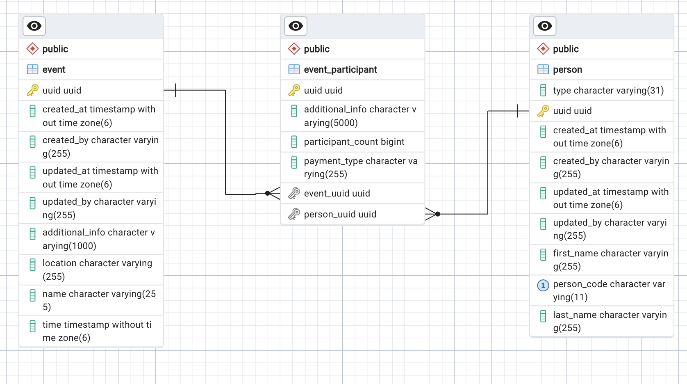

## Running the application
### Using Docker
From the root folder where docker-compose.yml is located run:
```bash
docker-compose up --build
```
### From bash/command line
#### 1. PostgreSQL

The backend application expects an "events_rik" database to exist at localhost:5432. The expected credentials are postgres/root.

If you wish to change the default credentials, postgreSQL address or the database name then you can do so at application.yml file in the backend application folder.

#### 2. Backend

- Requires port 8080 to be available 
- Java version used for development: 21.0.2

From the /backend directory, run:
```bash
./gradlew bootRun
```

OpenAPI documentation available at: http://localhost:8080/swagger-ui/index.html

#### 3. Frontend

- Requires port 5173 to be available
- npm version used when developing: 10.2.4
- node version: v20.11.1

From the /frontend directory, run:
```bash
npm install
```
Followed by:
```bash
npm run dev
```

After that, the application should be available at: http://localhost:5173/

## Running tests (bash/cmd)

### Backend

From the /backend directory:
```bash
./gradlew test
```

### Frontend

From the /frontend directory:
```bash
npm run test:unit
```

## ERD
